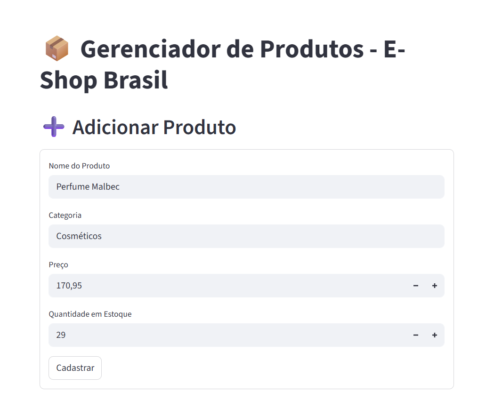
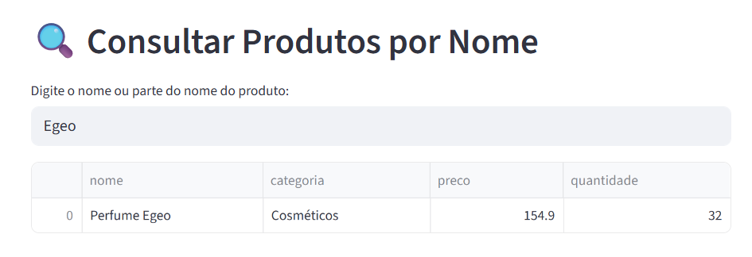
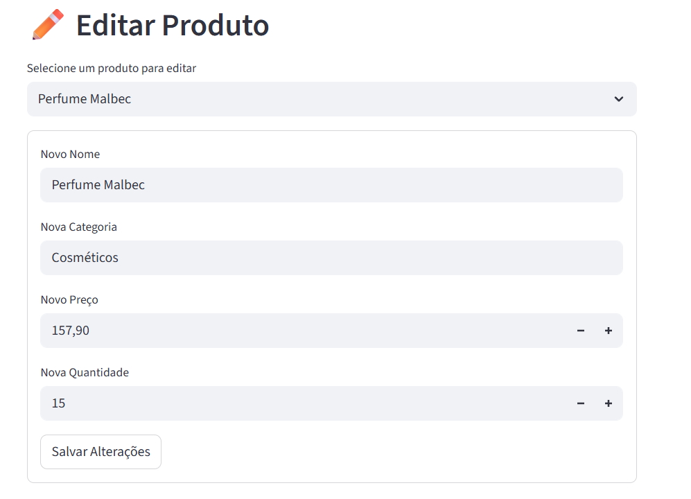
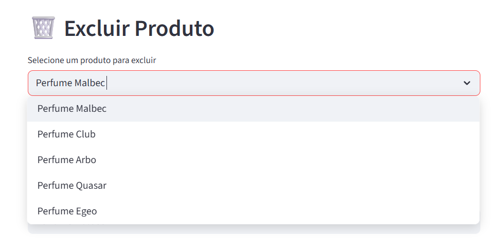
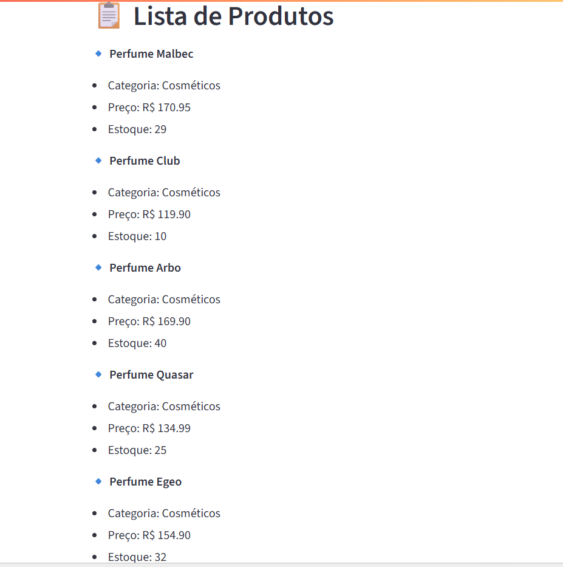
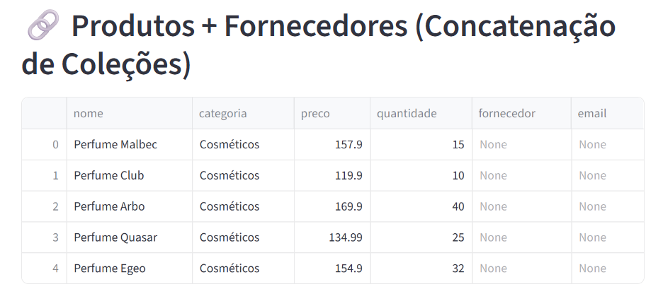

# 🛒 E-Shop Brasil - Projeto de Banco de Dados Avançado e Big Data

##  Introdução

Este projeto simula a aplicação prática de tecnologias de bancos de dados relacionais, NoSQL e Big Data em um cenário de comércio eletrônico. A empresa fictícia E-Shop Brasil enfrenta desafios de gestão de dados, personalização da experiência do cliente e otimização logística.


## Objetivos do Projeto

- Garantir a segurança e privacidade dos dados dos clientes.
- Personalizar a navegação e recomendações com base em comportamentos anteriores.
- Melhorar a eficiência da entrega e controle de estoque.
- Criar uma aplicação escalável e sustentável, conectando tecnologias modernas de dados.


##  Descrição do Projeto

###  Docker

O projeto utiliza Docker para criar um ambiente isolado e padronizado, evitando conflitos de dependência e facilitando a instalação. O container roda uma instância do MongoDB acessível localmente.

### MongoDB + Streamlit

A aplicação desenvolvida em Streamlit (app.py) permite:

- Inserção de produtos no banco MongoDB.
- Edição e exclusão individual de produtos.
- Consulta por nome.
- Concatenação de coleções (`produtos` e `fornecedores`).
- Visualização dos dados na interface gráfica interativa.


## Passos para Implementação

### 1. Clone o repositório

```bash
git clone https://github.com/MatheusYN/E-shop.git
cd E-shop

### Inserção de Produto


### Consulta de Produtos


### Edição de Produtos


### Exclusão de Produtos


### Listagem de Produtos


### Concatenação de Produtos

